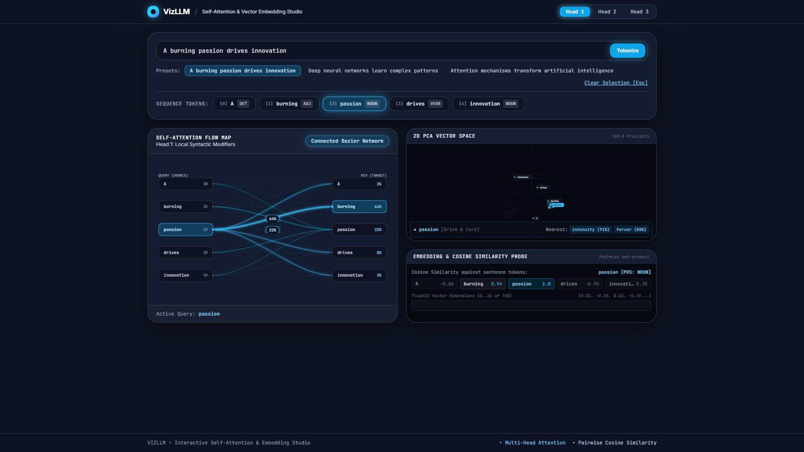

# VizLLM — Transformer Attention & Embedding Visualizer

An interactive web application built with React, TypeScript, and Tailwind CSS for visualizing how a Transformer model processes text through self-attention weights and word embeddings.

---

## Preview

<div align="center">
  
</div>

---

## About

**GitHub Description:**
> An interactive web application for inspecting Transformer self-attention weights and word embeddings with pan-and-zoom 2D PCA plots and token similarity analysis.

**GitHub Topics:**
`transformers` `nlp` `react` `typescript` `vite` `tailwind-css` `data-visualization` `machine-learning`

---

## Features

- **Self-Attention Graph**
  - Displays directed Bezier curves connecting sequence tokens to visualize attention weights.
  - Switch between multiple attention heads to inspect how different heads focus on syntax and semantics.
  - Hover or click on any token to highlight active attention paths and percentage weights.

- **Interactive 2D PCA Embedding Plot**
  - Plots 768-dimensional token embeddings projected onto a 2D coordinate plane.
  - Supports click-and-drag panning and mouse wheel zooming to inspect token clusters.
  - Displays nearest semantic neighbors and cosine similarity percentages when selecting a token.

- **Custom Sentence Input**
  - Type custom sentences or select preset benchmark sentences to tokenize and inspect.
  - Displays part-of-speech tags and token index positions.

- **Embedding & Similarity Inspector**
  - Calculates pairwise dot-product cosine similarity between sequence tokens.
  - Displays sample slices of the underlying 768-dimensional vector representation.

---

## Getting Started

### Prerequisites
- Node.js (v18 or higher)
- npm

### Installation & Run

1. Clone the repository:
   ```bash
   git clone https://github.com/yourusername/TransformerVizualizer.git
   cd TransformerVizualizer
   ```

2. Install dependencies:
   ```bash
   npm install
   ```

3. Start the local development server:
   ```bash
   npm run dev
   ```

4. Build for production:
   ```bash
   npm run build
   ```

---

## Tech Stack

- **React 18** + **TypeScript**
- **Vite**
- **Tailwind CSS**
- **Framer Motion**
- **Lucide React**

---

## License

MIT License
